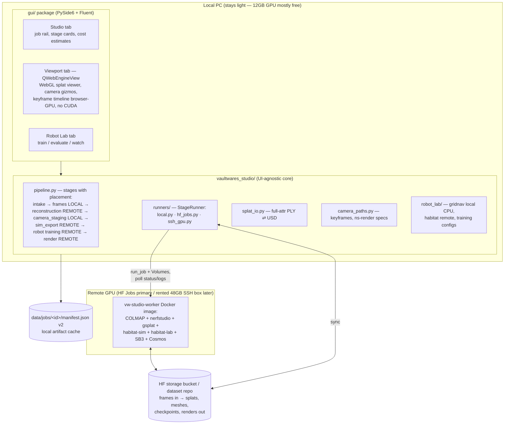

# VaultWares Studio — Plan to v1.0: Video → 3D Space → Camera Staging → Robot Training

## Context

`vaultwares-studio` already has a working foundation: a 5-stage resumable pipeline (video intake → frame extraction → reconstruction → USD cameras → output) with job manifests, a PySide6/Fluent desktop GUI, and fallback-safe placeholders. What's missing for the full vision — reconstruct home footage into navigable 3D spaces, stage cameras interactively, and train virtual robots to navigate them — is: real Gaussian-splat training, an interactive 3D viewport, the robot-sim/RL layer, and real (non-placeholder) Cosmos inference.

**User decisions (binding, revised):**
- Robot sim: **Habitat-Sim first, Isaac Sim deferred** to optional final milestone
- Compute: **remote-first** — the local PC stays light (it hosts the VaultWares API; no WSL, no local heavy training by default). Heavy stages run on rented GPU compute. Local heavy execution remains possible but opt-in.
- Remote backend: **Hugging Face Jobs as primary** (user has PRO, which gates Jobs access; pay-per-minute, custom Docker, no idle cost). **Generic SSH/GPU-server backend as second implementation** so a rented 48 GB box (L40S-class, e.g. NVIDIA Brev/RunPod) plugs in later — needed anyway if Cosmos Transfer 2.5 ever comes in scope. Note: HF *Spaces*/ZeroGPU are NOT the right shape (ZeroGPU caps GPU calls at ~120 s, PRO quota ~25 min/day H200 — splat training runs 20–60 min continuous); HF *Jobs* is the right product. NIM specifically = inference microservices; relevant only for the Cosmos inference piece, not for COLMAP/splat/RL training.
- Audience: **polished personal/prosumer desktop tool** (no public API server/accounts; installable EXE)
- Camera UX: **interactive real-time 3D viewport** (fly, place/aim cameras, keyframe paths)
- Localization (EN/QC): **lowest priority conceivable** — keep the existing `_STRINGS` mechanism so it stays cheap later, but no translation work in scope
- Submodules: edits to `cosmos-reason2/`, `vaultwares-adk/`, `vaultwares-themes/` happen in their standalone repos, never inside the submodule checkout (version-control hygiene, per SUBMODULE_BOUNDARIES)

**Key facts shaping the plan (verified):**
- Habitat-Sim has no Windows builds — but with remote-first compute this problem disappears: the Linux job container/GPU server runs habitat-sim natively. No WSL2 anywhere.
- HF Jobs: PRO-gated, custom Docker images, flavors incl. `l4x1` (24 GB), `a10g-small/large` (24 GB), `a100-large` (80 GB); per-minute billing; custom timeout (`timeout="2h"`); HF storage-bucket/dataset **Volumes** mountable read/write for artifact I/O — exactly the StageRunner shape.
- cuTile (NVIDIA CUDA Tile, `pip install cuda-tile`, released May 27 2026, CUDA 13.2, Ampere/Ada/Blackwell): a Python tile-kernel DSL. **Watch item, not a milestone** — this app consumes existing optimized kernels (gsplat/nerfstudio); cuTile matters only if we later write custom splat ops, and its library ecosystem is still maturing. Revisit if a custom renderer/trainer ever lands.
- `pipeline.py` `_run_command` uses blocking `subprocess.run` — no live progress today
- Splatfacto runs at only `--max-num-iterations 250`; exported splat PLY is flattened through Open3D, losing gaussian attributes (scale/rot/opacity/SH)
- `StageState.NEEDS_USER_INPUT` exists but is unused — perfect for interactive camera staging
- `requirements.txt` already lists nerfstudio, gsplat, transformers, bitsandbytes, trimesh, plyfile

## Architecture

Everything still flows through `data/jobs/<id>/manifest.json` (gains `schema_version: 2`, per-stage `placement` + `runner`, camera entities, sim assets, robot-lab sessions, remote artifact refs; v1 manifests migrate on load).

**StageRunner abstraction** (`vaultwares_studio/runners/base.py`): `StageContext` (job_dir, params, inputs, expected_outputs, progress callback, cancel token) + `StageRunner` protocol.
- `LocalStageRunner` — `Popen` + line-streamed stdout → live progress; used for cheap stages (ffprobe, ffmpeg frames, USD authoring, gridnav) and opt-in local heavy runs.
- `HfJobsStageRunner` — `huggingface_hub.run_job(image="<vw-studio-worker>", command=[...], flavor=..., timeout=..., volumes=[Volume(type="bucket", ...)])`; uploads stage inputs to the bucket, polls `inspect_job`/`fetch_job_logs` (rate-limited, ≥10 s interval per REQUEST_RATE_LIMITING), downloads `expected_outputs`, maps job log lines to progress. Cancel → `cancel_job`.
- `SshGpuStageRunner` — same contract over SSH + rsync to a user-configured GPU server (the future 48 GB box / Cosmos-NIM host). Implemented as a thin second backend once the contract is proven on HF Jobs.

**Cost guardrails (new, cross-cutting):** every remote stage shows an estimated cost (flavor × expected duration) and requires explicit user confirmation before launching a paid job — no unattended paid runs, ever (aligns with the company request-safety rule). A per-job spend ledger is recorded in the manifest.

**Worker image:** one Dockerfile (`docker/worker/Dockerfile`) built on `pytorch/pytorch:*-cuda12.x-devel`: COLMAP (CUDA), nerfstudio+gsplat, trimesh, habitat-sim+habitat-lab (conda, headless EGL), SB3, transformers+bitsandbytes. Published to Docker Hub (HF Jobs pulls public images) — keep weights out of the image; mount via HF Volumes. Single image keeps M1–M4 remote stages consistent.

---

## M0 — Remote execution foundation (~8 days) **(new, replaces "optional cloud hook")**

1. `runners/base.py` + `LocalStageRunner` (Popen streaming + cancel via `psutil`) — also delivers live progress for local stages.
2. `docker/worker/` image v1 (COLMAP + nerfstudio only; habitat/cosmos layers added in M3/M4). CI-less local build + push script.
3. `HfJobsStageRunner`: bucket layout (`<bucket>/jobs/<job-id>/<stage>/{in,out}`), upload/download with resumable hashes, job launch/poll/cancel, log streaming → progress, HF token in Settings (stored via OS keyring, never in manifest — SECRETS_HANDLING).
4. Manifest v2: `schema_version`, per-stage `placement`/`runner`/`params`/`cost`, migration for v1 jobs.
5. Cost-confirm dialog + spend ledger.
6. Stage placement defaults: frames/USD/staging local; reconstruction/sim_export/training/render remote.

Files: create `vaultwares_studio/runners/{__init__,base,local,hf_jobs}.py`, `docker/worker/Dockerfile`, `tools/build_worker_image.ps1`; modify `pipeline.py` (runner delegation), `gui_app.py` (settings: HF token, flavor defaults). Tests: runner contract tests with a fake runner; manifest v2 migration.

**Verify:** a trivial remote echo-stage round-trips files through a real HF Job on `cpu-basic` (<$0.01); local stages stream progress; cancel works both sides; `pytest` green.

## M1 — Real reconstruction, remote (~8 days)

1. **Remote reconstruction stage**: worker entrypoint runs `ns-process-data images --matching-method sequential` (sequential matching: video frames, 5–10× faster) → `ns-train splatfacto` → `ns-export gaussian-splat`, all inside one job; frames in / splat PLY + config out via the bucket.
2. **Quality presets** (`presets.py`) — now also pick the flavor:
   | Preset | iters | downscale | gaussian cap | flavor | est. cost/run |
   |---|---|---|---|---|---|
   | Draft | 7k | 4 | ~300k | `t4-small` or `l4x1` | well under $1 |
   | Standard | 15k | 2 | ~500k | `l4x1` / `a10g-small` (24 GB) | ~$1 |
   | High | 30k | 2 | ~1–2M | `a10g-large` / `a100-large` | a few $ |
   All: `--pipeline.datamanager.cache-images cpu`, `--vis none`; prefer MCMC strategy cap if nerfstudio ≥1.1.4 (probe `ns-train splatfacto --help` in the image at build time — flag spelling drifts). With 24–80 GB remote VRAM, the aggressive 12 GB caps relax; keep them as the "Local (opt-in)" preset row.
3. **Progress**: parse nerfstudio iteration lines from `fetch_job_logs` → per-stage progress bar.
4. **Full-attribute splat PLY** (`splat_io.py`, `plyfile`): stop flattening through Open3D; `cloud.ply` = full 3DGS attrs; decimated `cloud_preview.ply` (≤200k pts) for fallback viewing; `.ksplat` conversion for the M2 viewport.
5. **Proper PLY→USD**: probe `pxr` for OpenUSD 26.03 gaussian-splat schema; fallback = `UsdGeomPoints` + namespaced primvars (`primvars:gsplat:opacity/scale/rot/sh0…`) — lossless, forward-convertible. Runs locally (cheap).
6. OOM/failure handling: job log scan; auto-retry once at next-lower preset *after user confirm* (it costs money); structured error states for "too few registered images" with capture tips.

Files: modify `pipeline.py` reconstruction handler; create `splat_io.py`, `presets.py`, worker entrypoint `docker/worker/recon_entrypoint.py`; tests `test_splat_io.py` (synthetic gaussian PLY round-trip → USD), `test_presets.py`.

**Verify:** real room video → HF Job on `l4x1` → real splat PLY (>50 MB, `f_dc_*` present) downloaded and visible locally; cost shown beforehand and recorded; cancel mid-train leaves resumable manifest; `pytest` green.

## M2 — Interactive viewport + camera staging (~18 days, fully local)

**Viewer: QWebEngineView + mkkellogg/GaussianSplats3D (three.js, MIT), vendored.** Real 3DGS rendering (sorting, SH) at 60 fps for ≤500k splats via the browser GPU path — leaves the local CUDA GPU alone (it hosts the VaultWares API). Python⇄JS via QWebChannel; assets via URL-scheme handler, no web server. Rejected: native OpenGL renderer (3–6 weeks alone), Open3D (can't render gaussians). Day-1 spike: verify `QtWebEngineWidgets` imports in the existing `.venv`.

1. **`gui/` package split** (gui_app.py is 64 KB and this milestone adds viewport/timeline/bridge): `gui/{theme,strings,main_window,viewport,timeline,robot_lab}.py` + `gui/widgets/`; `gui_app.py` stays a thin entrypoint (PyInstaller spec stable).
2. **Viewport tab**: vendored viewer under `vaultwares_studio/webviewer/`; loads job `.ksplat`; WASD/orbit; "drop camera here" captures view pose.
3. **`CameraEntity`** (id, name, fov, pose, keyframes) in `camera_director.py`; serialized into manifest + USD time-sampled xformOps. Prompt-based cameras become seeds the user refines.
4. **Keyframe timeline** (`gui/timeline.py`) + `camera_paths.py` (Catmull-Rom positions, slerp orientations); scrubbing drives the JS camera live.
5. **Offline walkthrough**: export path to nerfstudio camera-path JSON → `ns-render camera-path` as a *remote* stage (uploads path JSON, reuses the trained config already in the bucket; 1080p/30fps, minutes on l4) — or local opt-in. ffmpeg PNG fallback when no trained model.
6. **Stage rename** `usd_cameras` → `camera_staging`; auto-completes with presets, uses `NEEDS_USER_INPUT` when the user edits; "Apply staging" re-authors USD + path JSON.

Cost: QtWebEngine adds ~150 MB to the packaged EXE (accepted). Degradation: no WebEngine → Open3D preview + numeric camera editing.

**Verify:** 3 cameras + 10-keyframe path on a real reconstruction; scrub matches; remote ns-render returns a smooth 1080p MP4 along the authored path; cameras survive restart (manifest + USD reopen); interpolation golden tests green.

## M3 — Robot Lab: navigation training (~16 days)

**Backend strategy:** `NavSimBackend` interface (`robot_lab/base.py`: load_scene/reset/step/sample_episodes + `EpisodeRecord` with success/SPL).
- **Grid-nav backend (local, CPU, free)**: ~400-line gymnasium env over the occupancy grid — instant iteration, deterministic, CI-testable. Default for quick experiments.
- **Habitat-Sim backend (remote)**: runs *natively in the Linux worker image* (conda habitat-sim withbullet headless + habitat-lab). No WSL2, no Windows porting. Training submitted as an HF Job / SSH job; checkpoints + episode trajectories sync back through the bucket.

1. **`sim_export` stage** (remote, after camera_staging): `ns-export poisson` → mesh; `trimesh` cleanup (largest component, decimate ≤200k tris); 2.5D occupancy grid (`occupancy.npz`, configurable robot height/clearance); Habitat navmesh (recast) built in the same job. Artifacts to `jobs/<id>/sim/`.
2. **Grid-nav env** (`robot_lab/gridnav.py`, local): actions {forward 0.25 m, turn ±10°, stop}; obs = PointNav GPS+compass + 16-ray depth scan; reward = −Δgeodesic + success bonus + slack (scipy shortest path).
3. **Training** (`robot_lab/training.py`): SB3 PPO config dataclass; grid backend trains locally on CPU (1M steps ≈ 20–40 min) or remotely; Habitat PointNav trains remotely via habitat-lab's PPO baseline (RGB-D from the reconstructed mesh), e.g. `a10g-small`, timeout "4h", checkpoints to the bucket. Eval = success rate + SPL over 100 held-out episodes. All headless-callable (PRD US-005).
4. **Replay in the splat viewer**: trajectories animate a robot marker + trail via the M2 bridge; "robot POV" walkthrough reuses the ns-render path machinery.
5. **Robot Lab GUI tab**: backend selector w/ status, Train (live reward curve from streamed job logs/scalars), Evaluate (success/SPL table), Watch (replay), cost confirm on remote runs.

New local deps: `gymnasium`, `stable-baselines3`, `tensorboard` (~20 MB; torch already present). Worker image grows habitat layers (~4–6 GB image).

**Verify:** real room job → mesh + occupancy grid (overlay in viewport); grid-PPO ≥80% success on 100 eval episodes locally; Habitat remote job trains PointNav on the same scene and replays in the viewer; deterministic gridnav unit tests green.

## M4 — Cosmos AI layer (~5 days)

1. **Cosmos Reason 2 annotation as a remote stage** (default): worker runs `nvidia/Cosmos-Reason2-2B` (fp16 on 24 GB — no quantization needed remotely) over 6–12 sampled frames → `cosmos_annotations.json` v2 (objects, labels, confidence). Prompt formats referenced read-only from the `cosmos-reason2` submodule. Local INT4 (bitsandbytes, ~2–3 GB) stays as an opt-in for offline use.
2. **ObjectNav hook**: back-project labeled objects via COLMAP poses onto the mesh → goal candidates in Robot Lab ("navigate to the desk"); confidence threshold + user-confirm chips.
3. **Cosmos Transfer 2.5**: out of local scope (16–24 GB+); becomes viable the day a 48 GB SSH box is configured — the `SshGpuStageRunner` + a NIM/Transfer entrypoint slot is the integration seam, scope-boxed, not built now.
4. Default OFF; placeholder path remains.

**Verify:** remote annotation produces real labels on the demo room (desk/chair); without the feature, output identical to today; offline mocked-model schema test green.

## M5 — Polish & packaging (~8 days)

1. **First-run onboarding**: dependency health, HF token setup + bucket creation, optional SSH GPU server config, capture-quality tips, one-click demo job (local Draft or cheapest remote).
2. **Error surfacing**: actionable cards (too few registered frames, job failed/timeout, bucket sync errors, ffmpeg missing) with fix-it buttons; structured `errors` on stage records.
3. **Spend dashboard**: per-job and cumulative remote spend from the manifest ledger.
4. **Packaging**: two-part install — slim EXE (GUI + core + WebEngine, ~400 MB) + first-run env setup for the light local venv. Remote-first means the heavy 8 GB torch/nerfstudio venv is now *optional* (only for opt-in local execution) — the default install shrinks dramatically. Optional Inno Setup wrapper.
5. **Docs**: README rewrite, ROADMAP/TODO/TESTING refresh, `docs/user-guide.md`.
6. **Strings**: keep everything flowing through the existing `_STRINGS`/`_t()` mechanism (extracted to `gui/strings.py` in M2) so future QC translation is a fill-in job — **no translation work now** (user: lowest priority).

**Verify:** fresh Windows VM, no dev tools: installer → onboarding (HF token) → demo video → remote reconstruction → viewport staging → walkthrough → grid robot training, zero terminal usage; `pytest` green; verification runs recorded.

## M6 — Isaac Sim bridge (optional, deferred, ~10+ days)

Runs *remotely* (Isaac headless on the SSH 48 GB box or `a100-large`; solves the 12 GB marginality entirely): compose job USD + sim mesh into an Isaac-ready stage with physics colliders; load + camera smoke script. Isaac Lab RL out of scope. Seam = `NavSimBackend` + `SshGpuStageRunner`.

---

## Sequencing & effort

| Milestone | Depends on | Effort |
|---|---|---|
| M0 Remote execution foundation | — | ~8 d |
| M1 Remote reconstruction | M0 | ~8 d |
| M2 Viewport + staging | M1 | ~18 d |
| M3 Robot Lab | M1 (mesh); gridnav can parallel M2 | ~16 d |
| M4 Cosmos | M0/M1; M3 for ObjectNav | ~5 d |
| M5 Polish + packaging | all | ~8 d |
| **Total M0–M5** | | **~63 days (~3 months solo)** |

## Cross-cutting rules

- Submodule edits happen in the standalone repos (`cosmos-reason2`, `vaultwares-adk`, `vaultwares-themes`), never in the submodule checkouts
- No paid remote job launches without explicit per-run user confirmation + cost estimate; job-status polling ≥10 s intervals (REQUEST_RATE_LIMITING)
- HF token via OS keyring, never in manifests/logs (SECRETS_HANDLING)
- Extend `pipeline.py` stages + manifest contract; never rewrite the core
- cuTile (`cuda-tile`, CUDA 13.2): watch item only — revisit if custom splat kernels ever needed
- Each milestone ends with its documented verification run, recorded per VERIFICATION protocol
- Protocols applied: SOURCE_OF_TRUTH, SUBMODULE_BOUNDARIES, SECRETS_HANDLING, REQUEST_RATE_LIMITING, DEPENDENCY_POLICY, VERIFICATION

## Critical files

- `vaultwares-studio\vaultwares_studio\pipeline.py` — stage handlers, manifest, runner delegation (every milestone)
- `vaultwares-studio\gui_app.py` — source for M2 `gui/` split; existing `_STRINGS`/`_t` mechanism
- `vaultwares-studio\vaultwares_studio\camera_director.py` — extends to `CameraEntity` + paths
- `vaultwares-studio\vaultwares_studio\viewer.py` — becomes Open3D fallback
- New: `vaultwares_studio/runners/`, `vaultwares_studio/splat_io.py`, `docker/worker/Dockerfile`, `gui/` package
- `vaultwares-studio\requirements.txt` — new pins: psutil, huggingface_hub, keyring, gymnasium, stable-baselines3, tensorboard
